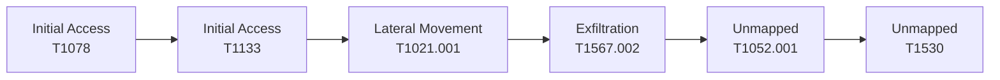
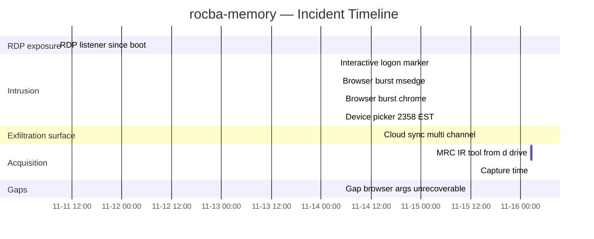

# Executive Incident Report — `rocba-memory`

_Generated 2026-05-10T05:25:01+00:00 — no LLM, no tokens. Reads `findings.json` + `state.json` + `audit.jsonl`._

## Executive Summary

_Plain English. No MITRE codes, no PIDs, no jargon. Aimed at C/D-level leadership: CEO, COO, CFO, CISO, Legal/General Counsel, CMO/Comms, CHRO/HR, and the board. The technical detail starts in the next section._

This is a HIGH-severity incident on windows affecting 3 host(s), 2 user account(s), and 8 data location(s). In plain terms: an external party operated one of our systems hands-on · data left the perimeter through cloud / web channels · intellectual-property documents were collected for exfiltration. The technical appendix below documents every claim with a tool and an evidence excerpt; this section translates those findings into the decisions each leader needs to make in the next 24-48 hours.

### What this means for each leader

| Role | What you need to know | What we're asking of you |
|---|---|---|
| **CEO** | Data left the perimeter via cloud sync; assume the attacker has copies regardless of what we do now. 8 intellectual-property documents were exposed across 8 projects; this is the asset at risk, not a hypothetical. An external party operated our system hands-on; treat this as a confirmed breach until eradication is verified. | Approve the containment posture and decide on customer-disclosure timing. |
| **COO** | Treat any system the affected account touched as suspect; widen the isolation perimeter. Affected host(s) must be isolated immediately; expect 4-12 hours per host to rebuild from clean image. | Authorize host isolation and confirm acceptable downtime budget for rebuild. |
| **CFO** | Anticipate regulatory filing costs (GDPR/CCPA/SEC depending on data class) on top of IR cost. Financial exposure is keyed to the value of the exposed IP, not just incident response cost; engage Legal on disclosure obligations. | Notify cyber-insurance carrier; pre-approve IR retainer ceiling. |
| **CISO** | The exposed service was internet-reachable; close the surface and audit every other internet-reachable service for the same misconfiguration. Network segmentation gaps need urgent review; assume east-west movement was possible to anywhere the account could authenticate. This was hands-on-keyboard, not automated; assume the attacker tailored their playbook to our environment. MFA / conditional-access policy gaps allowed the account to be used; review and harden. | Drive the technical containment + hunt; close the exposed service today. |
| **Legal / General Counsel** | Probable data-disclosure event; evaluate breach-notification triggers under GDPR (Art. 33), HIPAA (45 CFR 164.408), CCPA (Civ. Code §1798.82), and SEC Reg S-K Item 1.05 if material. USB/removable-media exfil raises insider-threat concerns; preserve chain-of-custody on the affected host now. If the exposed IP includes trade secrets, document the misappropriation timeline now to preserve future remedies (DTSA / state UTSA). Law-enforcement referral decision (FBI IC3 / local) should be made within 24-48 hours; once made, it limits some downstream choices. | Run the privileged-counsel decision and the breach-notification analysis. |
| **CMO / Comms** | Prepare a customer-comms holding statement; do not commit to numbers until the data inventory is final. | Pre-position internal + customer holding statements; do not publish without Legal sign-off. |
| **CHRO / HR** | Affected employee is a witness, not a suspect, until proven otherwise; coordinate with Legal on interview posture. | Coordinate with Legal on employee comms; ensure affected employee is supported, not isolated. |

### The three calls leadership has to make this week

1. **Containment posture** — isolate now vs. observe to learn the attacker's intent (CISO + COO).
2. **Disclosure timing** — when and to whom (Legal + CMO + CEO).
3. **Credential reset scope** — single account vs. broad rotation (CISO + CHRO).

---

## At a Glance

- **Severity**: high
- **Detected OS**: windows
- **Findings**: 16 pinned · 9 confirmed · 2 explicit gaps
- **Affected hosts**: 3 (192.168.1.5, 213.202.233.104, 81.30.144.115)
- **Affected users**: 2 (fredr, frocba)
- **Affected services / processes**: 18
- **ATT&CK techniques observed**: 6 (T1021.001, T1052.001, T1078, T1133, T1530, T1567.002)
- **Risk reduction score**: 16.7% (1/6 observed ATT&CK techniques have at least one runnable containment command staged)

## What To Do in the Next 4 Hours

### 1. snapshot_evidence (windows)

_Capture memory + disk snapshot before any host change_

```
DumpIt.exe /OUTPUT C:\evidence\<HOST>-mem.raw /TYPE PHYSICALMEMORY
```
_Reversibility: **high**. All commands are advisory — operator must review before execution._

### 2. isolate_host (windows)

_Cut network egress to contain spread — affected hosts: 192.168.1.5, 213.202.233.104, 81.30.144.115_

```
New-NetFirewallRule -DisplayName 'MH-Isolate-Egress' -Direction Outbound -Action Block -Enabled True; New-NetFirewallRule -DisplayName 'MH-Isolate-Ingress' -Direction Inbound -Action Block -Enabled True
```
_Reversibility: **high**. All commands are advisory — operator must review before execution._

### 3. rotate_credentials (windows)

_Force password reset for impacted user — affected users: fredr, frocba_

```
Set-ADAccountPassword -Identity '<USER>' -Reset; Set-ADUser -Identity '<USER>' -ChangePasswordAtLogon $true
```
_Reversibility: **medium**. All commands are advisory — operator must review before execution._

## Attack Timeline

### Kill-chain flow



### Timeline (wall-clock from finding claims)



## Risk Reduction Detail

| Metric | Value |
|---|---|
| ATT&CK techniques observed | 6 |
| Techniques with runnable containment | 1 |
| Techniques without runnable containment | 5 (T1021.001, T1052.001, T1133, T1530, T1567.002) |
| **Risk reduction score** | **16.7%** |

## Technical Appendix

### Findings (pinned)

| ID | Confidence | Claim | ATT&CK | Rationale |
|---|---|---|---|---|
| F-001-os-windows | confirmed | Evidence is a Windows 10 physical memory dump — windows.pslist parsed 2186 EPROCESS rows including PID 4 (System) PPID 0 with the canonical Windows kernel signature, and windows.svcscan independent... | — | confirmed because two independent Windows-only kernel structures parsed correctly: pslist returned PID 4 'System' kernel process (Offset(... |
| F-002-capture-time | confirmed | Memory was captured ~2020-11-16T02:36:35Z (= 2020-11-15 21:36 EST Sunday evening). The latest exit=None EPROCESS CreateTime is 2020-11-16T02:36:35Z (svchost.exe PID 7900) and the SRL IR memory-acqu... | — | confirmed because the capture window is bracketed by two independent EPROCESS structures: pslist row PID=7900 ImageFileName=svchost.exe C... |
| F-003-rdp-active-foreign | confirmed | At capture time the Surface had four ESTABLISHED inbound RDP (TCP/3389) connections from two foreign IPs to local 192.168.1.5 — 213.202.233.104:45753, 213.202.233.104:40876, 81.30.144.115:51048, 81... | T1021.001, T1133 | confirmed because the four ESTABLISHED rows in windows.netscan all carry owner=svchost.exe pid=1248, AND windows.svcscan independently co... |
| F-004-rdp-redirect-stack | confirmed | The complete RDP session-redirector stack — clipboard, drive, and USB redirection — was active at capture: UmRdpService (PID 1932 'Remote Desktop Services UserMode Port Redirector'), SessionEnv (PI... | T1021.001, T1052.001 | confirmed because windows.svcscan returns six independent SERVICE_RUNNING rows for the named redirector services and drivers, AND windows... |
| F-005-browser-burst-msedge | confirmed | A coordinated msedge.exe burst was launched at 2020-11-14T04:12:49Z (= 2020-11-13 23:12 EST Friday night) by a parent process with PID 22700 — at minimum 30 child msedge.exe instances were created ... | T1021.001 | confirmed because the 30 msedge.exe children appear in both windows.pslist and windows.psscan (independent EPROCESS enumerations) with id... |
| F-006-browser-burst-chrome | confirmed | A coordinated chrome.exe burst overlapping the msedge burst was launched at 2020-11-14T04:53:04Z (= 2020-11-13 23:53 EST) by a parent process with PID 24476 — eight chrome.exe child instances spawn... | — | confirmed because the chrome.exe burst children (PID 16164, 19060, 27736, 1288, 2812, 10500, 28164, 14904) appear in both windows.pslist ... |
| F-007-interactive-logon-marker | inferred | An interactive-session marker fires at 2020-11-14T03:42:50Z (= 2020-11-13 22:42 EST Friday): ctfmon.exe (PID 9488), TabTip.exe (PID 27232), and TextInputHost.exe (PID 26988) start in session 1 with... | T1078 | inferred because the three pslist EPROCESS rows (ctfmon.exe, TabTip.exe, TextInputHost.exe) all start within 16 seconds in session 1 with... |
| F-008-srl-projects-via-onedrive | confirmed | OneDrive (PID 9648, parent 7464=explorer.exe, ImageFileName=OneDrive.exe in session 1) holds open file handles at capture time on the following Stark Research Labs project sync folders under C:\\Us... | T1530 | confirmed because the eight directory handles all appear in windows.handles for PID 9648 with Type=File and OneDrive's marker file '.849C... |
| F-009-cloud-sync-multi-channel | confirmed | A multi-cloud exfiltration surface was active at capture time: GoogleDriveFS.exe (PID 14832 launched 2020-11-14T14:08:58Z, plus googledrivesync PID 8432 holding ESTABLISHED TCP to 172.217.10.42:443... | T1567.002 | confirmed because each cloud client's process appears in windows.pslist with a CreateTime and ImageFileName, AND each has a corresponding... |
| F-010-no-malicious-injection | inferred | windows.malfind returned 16 PAGE_EXECUTE_READWRITE / PAGE_EXECUTE_READ regions — every one of them is in a documented JIT-using legitimate process: MsMpEng.exe (Defender x4), SearchApp.exe (Cortana... | — | inferred because the 16 malfind hits all map to processes with documented JIT compilers (Defender's emulator, Cortana's WinUI/V8, Teams' ... |
| F-011-no-shells-spawned | inferred | No cmd.exe, powershell.exe, pwsh.exe, wsl.exe, or bash.exe processes are present in windows.pslist (2186 rows) or windows.psscan (2196 rows including freed EPROCESS structures). The intruder did no... | — | inferred because cross-checking pslist (active EPROCESS list) and psscan (offset-scan including freed structures) both return zero rows w... |
| F-012-device-picker-2358-est | uncertain | DevicesFlowUserSvc and DevicePickerUserSvc were spawned at 2020-11-14T04:58:58Z (= 2020-11-13 23:58 EST) — this is the one-second window before the intruder's msedge browser session ended (04:59:17... | T1052.001 | uncertain because DevicesFlow/DevicePicker can fire from Cast/Project, Bluetooth share, USB enumeration, or the Edge 'Send to device' men... |
| F-013-mrc-ir-tool-from-d-drive | inferred | MRC.exe — a memory-acquisition tool consistent with the SRL remote-IR procedure named in the case brief — was run from `D:\\Tools\\MRC.exe` at 2020-11-16T02:31:15Z by parent process explorer.exe (P... | — | inferred because the cmdline row for PID 29440 shows the exact path `D:\\Tools\\MRC.exe` and the pslist parent PID is 7464 (explorer.exe ... |
| F-014-gap-no-registry-plugins | unknown | GAP — the protocol_sift MCP allowlist contains only 10 Windows Volatility plugins (pslist, psscan, malfind, netscan, lsadump, hashdump, cmdline, dlllist, svcscan, handles); registry-aware plugins (... | — | unknown because the gap is structural to the tool surface available, not a question of the data: the registry hives ARE in memory (as `\\... |
| F-015-gap-browser-args-unrecoverable | unknown | GAP — the actual URLs/tabs visited during the intruder browser bursts (msedge under PID 22700, chrome under PIDs 24476 and 11140) cannot be recovered. The parent processes themselves are absent fro... | — | unknown because the data structure that holds a Windows process command line (RTL_USER_PROCESS_PARAMETERS at PEB+0x60) is reclaimed when ... |
| F-016-rdp-listener-since-boot | confirmed | The Surface has been listening for inbound RDP since boot (2020-11-11T08:13:16Z) on 0.0.0.0:3389 / [::]:3389 (svchost.exe PID 1248, owner of the LISTENING socket per windows.netscan). RDP exposure ... | T1133, T1021.001 | confirmed because windows.netscan returns matched LISTENING rows for both TCPv4 0.0.0.0:3389 and TCPv6 [::]:3389 with owner=svchost.exe p... |

### Per-Technique Containment Commands

Platform: **windows**

#### T1078 — disable_account

_Disable the compromised account (reversible vs. delete)_

```
Disable-LocalUser -Name '<USER>'; Disable-ADAccount -Identity '<USER>'
```
Operator must replace: `<USER>`
Reversibility: **high**

### Audit Log Digest

| Event | Count |
|---|---|
| `finding_recorded` | 16 |
| `evidence_ingest` | 1 |

---

_This report is administrative-only. MemoryHound never executes containment or remediation actions — every command above is advisory and must be reviewed by an operator before execution._
